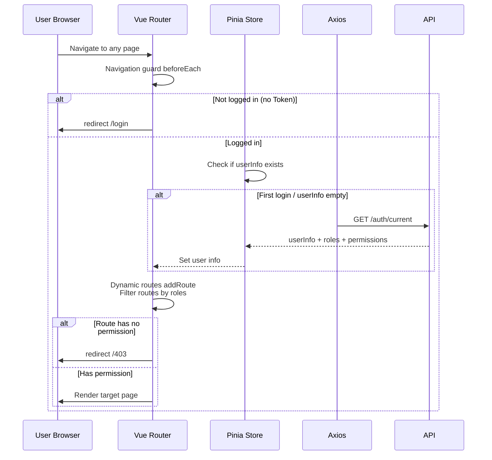

<div align="center">
    
    
    
    
    <a href="https://github.com/junwOpenSourceProjects/JOSP-SystemTempleVue3" target="_blank">
        
    </a>
    <div align="center"> <a href="./README.md">中文</a> | English</div>
</div>

---

# JOSP-System Frontend

Enterprise-grade admin frontend built with Vue 3, Vite, TypeScript, Element Plus, and ECharts.

## Tech Stack

| Category | Technology | Version |
|----------|-----------|---------|
| Framework | Vue 3 | 3.4+ (Composition API + `<script setup>`) |
| Build Tool | Vite | 8.x |
| Language | TypeScript | 5+ (strict mode) |
| UI Library | Element Plus | 2.4+ |
| State Management | Pinia | 2.1+ |
| Router | Vue Router | 4+ (dynamic routing) |
| HTTP Client | Axios | 1.6+ (request/response interceptors) |
| Visualization | ECharts | 5.5+ |
| CSS | UnoCSS | 0.58+ (atomic CSS) |
| Icons | @iconify/vue + unocss-presets | latest |

---

## System Architecture

```mermaid
graph TB
    subgraph Client "Browser"
        APP["Vue 3 App<br/>Composition API"]
        ROUTE["Vue Router 4<br/>Dynamic Routes + Navigation Guards"]
        STORE["Pinia Store<br/>User Info / Permissions / Theme"]
    end

    subgraph Request Layer "Axios"
        AX["Axios Instance<br/>Request Interceptor (Token)<br/>Response Interceptor (Error)"]
    end

    subgraph Backend "Spring Boot :8081"
        API["REST API<br/>/api/v1/*"]
    end

    APP --> ROUTE
    APP --> STORE
    STORE --> AX
    AX --> API

    style APP fill:#e1f5ff,stroke:#1456f0,color:#000
    style API fill:#fff3e1,stroke:#f0a020,color:#000
```

---

## Project Structure

```
src/
├── api/                        # API layer — all HTTP requests
│   ├── auth.ts                # Login / Logout / Current user
│   ├── config.ts              # System configuration
│   ├── dashboard.ts           # Dashboard data
│   ├── notice.ts              # Announcements
│   ├── dept.ts                # Department management
│   ├── dict.ts                # Dictionary queries
│   ├── menu.ts                # Menu management
│   ├── role.ts                # Role management
│   ├── user.ts                # User management
│   ├── loginLog.ts            # Login logs
│   ├── operLog.ts             # Operation logs
│   ├── file.ts                # File management
│   └── demo.ts                # Demo API
│
├── components/                # Shared components
│   └── CURD/                  # Generic CRUD components (PascalCase)
│       ├── PageSearch.vue     # Paginated search bar
│       ├── PageTable.vue      # Paginated data table
│       └── PageModal.vue      # Modal form
│
├── composables/               # Composables (hooks)
│   ├── useCountUp.ts         # Number counter animation
│   ├── useDict.ts            # Dictionary data fetching
│   └── useTabs.ts            # Tab management
│
├── layout/                    # Layout components
│   ├── index.vue             # Main layout (sidebar + topbar)
│   ├── Sidebar.vue           # Sidebar navigation
│   └── Topbar.vue            # Topbar navigation
│
├── router/                    # Router configuration
│   ├── index.ts              # Router instance + guards
│   └── routes/               # Static routes + dynamic routes
│
├── store/                     # Pinia state management
│   └── modules/
│       ├── user.ts           # User info + Token
│       ├── permission.ts     # Permission route tree
│       └── tab.ts            # Multi-tab pages
│
├── styles/                    # Global styles
│   ├── variables.css         # CSS variables (theme colors / radius / shadow)
│   └── index.css             # Global reset + fonts
│
├── utils/                     # Utilities
│   ├── request.ts            # Axios instance wrapper
│   ├── auth.ts              # Token read/write / user info parsing
│   └── format.ts            # Date / number formatting
│
└── views/                     # Page views
    ├── dashboard/            # Dashboard (ECharts)
    ├── login/                # Login page (split layout)
    ├── personal/             # Personal center
    ├── notice/               # Announcements
    ├── error-page/           # 404 / 403 error pages
    └── system/               # System management
        ├── user/            # User management
        ├── role/             # Role management
        ├── menu/             # Menu management
        ├── dept/             # Department management
        ├── dict/             # Dictionary management
        ├── login-log/        # Login logs
        ├── oper-log/         # Operation logs
        └── monitor/          # System monitor
```

---

## Feature Modules

| Page | Route | Description |
|------|-------|-------------|
| Login | `/login` | Username/password login, captcha, theme toggle |
| Dashboard | `/dashboard` | ECharts charts (user stats / visit trends / dept distribution) |
| Personal Center | `/personal` | User profile, password change |
| User Management | `/system/user` | User CRUD, role assignment, status management |
| Role Management | `/system/role` | Role CRUD, menu permission assignment |
| Menu Management | `/system/menu` | Menu tree CRUD (M directory / C menu / B button) |
| Department | `/system/dept` | Department tree CRUD |
| Dictionary | `/system/dict` | Dictionary type + dictionary data management |
| Login Logs | `/system/login-log` | Login log pagination, IP geolocation |
| Operation Logs | `/system/oper-log` | Operation log pagination, detail view, clear |
| Announcements | `/notice` | Announcement list, publish, revoke, pin |
| System Monitor | `/system/monitor` | Server / database / Redis status cards |
| System Config | `/system/config` | System parameter configuration |

---

## Page Layout

```
┌──────────────────────────────────────────────────────────┐
│  [Logo / System Name]  │  Topbar: Breadcrumb + User + Logout  │
├────────────┬─────────────────────────────────────────────┤
│            │                                             │
│  Sidebar   │           Main Content Area                 │
│  Nav Menu  │                                             │
│            │  ┌─────────────────────────────────────┐     │
│  ○ Dashboard│  │  [Page Title]  [Action Buttons]  │     │
│  ○ System   │  ├─────────────────────────────────────┤     │
│    - User   │  │  [Search / Filter Bar]              │     │
│    - Role   │  ├─────────────────────────────────────┤     │
│    - Menu   │  │                                     │     │
│    - Dept   │  │  [Data Table / Chart / Form]        │     │
│  ○ Logs    │  │                                     │     │
│  ○ Notice  │  └─────────────────────────────────────┘     │
│  ○ Monitor │                                             │
└────────────┴─────────────────────────────────────────────┘
```

---

## Route Authentication Flow



---

## Theme & Design Specs

This project follows the design system defined in `DESIGN.md`.

### Brand Colors

| Usage | Color | Description |
|-------|-------|-------------|
| Primary (Brand Blue) | `#1456f0` | Sidebar / buttons / links |
| Success | `#10b981` | Normal status / success |
| Warning | `#f59e0b` | Warning status |
| Danger | `#ef4444` | Error / delete / deactivate |
| Info | `#3b82f6` | Info notice |

### Typography

| Usage | Font | Fallback |
|-------|------|----------|
| Chinese body | `DM Sans` | `Outfit`, sans-serif |
| English/numbers | `Outfit` | sans-serif |
| Code | `JetBrains Mono` | `Fira Code`, monospace |

### Border Radius

- Buttons/inputs: `9999px` (pill)
- Cards/containers: `12px`
- Modals/dropdowns: `16px`

### Shadows

- Cards: `0 1px 3px rgba(0,0,0,0.1), 0 1px 2px rgba(0,0,0,0.06)`
- Hover: `0 4px 16px rgba(20,85,240,0.16)` (brand blue glow)

---

## Environment Variables

| Variable | Description | Default |
|----------|-------------|---------|
| `VITE_APP_TITLE` | Browser tab title | `JOSP-System` |
| `VITE_API_BASE_URL` | Backend API base path | `/api/v1` |

---

## Quick Start

### Requirements

- Node.js 18+
- pnpm 8+

### Install & Run

```bash
# Install dependencies
pnpm install

# Development (hot reload)
pnpm dev
# Access http://localhost:5173

# Type check (non-blocking in dev)
pnpm type-check

# Production build
pnpm build

# Preview build output
pnpm preview

# ESLint check
pnpm lint
```

### Build Output

| Output | Path |
|--------|------|
| Build artifacts | `dist/` |
| Bundle analysis | `dist/stats.html` (run `pnpm preview` to view) |

---

## Connecting to Backend

All frontend requests go through `src/utils/request.ts` with BaseURL pointing to `/api/v1`.

**Request interceptor**: automatically injects `Bearer {token}` into the `Authorization` header.

**Response interceptor**: auto-redirects to login on 401, to 403 page on 403, and shows error message on 500+.

---

## Related Docs

- [DESIGN.md](DESIGN.md) — Design system specification
- [../../JOSP-SystemTempleJava/README.md](../JOSP-SystemTempleJava/README.md) — Backend README
