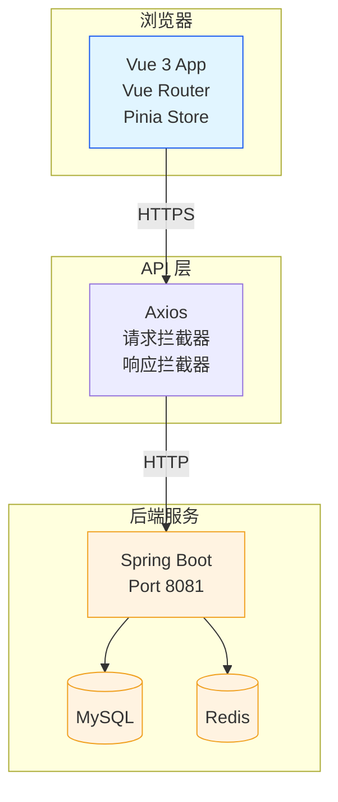
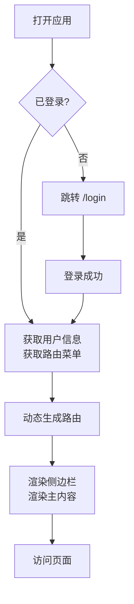

# JOSP-System 前端

企业级后台管理系统前端，基于 Vue 3 + Vite + TypeScript 构建，采用 Element Plus 组件库和 ECharts 数据可视化。

## 技术栈

| 分类 | 技术 | 版本 |
|------|------|------|
| 核心框架 | Vue 3 | 3.4+ (Composition API) |
| 构建工具 | Vite | 8+ |
| 语言 | TypeScript | 5+ |
| UI 组件库 | Element Plus | 2.4+ |
| 状态管理 | Pinia | 2.1+ |
| 路由 | Vue Router | 4+ |
| HTTP 客户端 | Axios | 1.6+ |
| 可视化 | ECharts | 5.5+ |
| CSS 方案 | UnoCSS | 0.58+ |

## 项目结构

```
src/
├── api/                  # API 接口层
│   ├── auth/             # 认证相关 API
│   ├── dashboard/        # 看板 API
│   ├── notice/           # 通知公告 API
│   └── system/           # 系统管理 API
├── components/          # 公共组件
├── composables/          # 组合式函数
├── layout/               # 布局组件
├── router/               # 路由配置
├── store/                # Pinia 状态管理
│   └── modules/          # Store 模块
├── styles/               # 全局样式
├── utils/                # 工具函数
└── views/                # 页面视图
    ├── dashboard/        # 数据看板
    ├── login/            # 登录页
    ├── notice/           # 通知公告
    ├── personal/         # 个人中心
    └── system/           # 系统管理
        ├── user/         # 用户管理
        ├── role/         # 角色管理
        ├── menu/         # 菜单管理
        └── dept/         # 部门管理
```

## 功能模块

| 页面 | 路径 | 说明 |
|------|------|------|
| 登录 | `/login` | 用户登录、验证码 |
| 管理看板 | `/dashboard` | ECharts 图表、数据卡片 |
| 个人中心 | `/personal` | 个人信息、密码修改 |
| 用户管理 | `/system/user` | 用户 CRUD、分配角色 |
| 角色管理 | `/system/role` | 角色 CRUD、分配菜单 |
| 菜单管理 | `/system/menu` | 菜单 CRUD、图标选择 |
| 部门管理 | `/system/dept` | 部门树形 CRUD |
| 字典管理 | `/system/dict` | 字典类型和数据 |
| 登录日志 | `/system/login-log` | 登录日志分页查询 |
| 操作日志 | `/system/oper-log` | 操作日志分页查询 |
| 通知公告 | `/notice` | 公告列表、编辑、发布 |
| 系统监控 | `/system/monitor` | 服务器、Redis、DB 状态 |

## 快速开始

### 环境要求
- Node.js 18+
- pnpm 8+

### 安装依赖

```bash
pnpm install
```

### 开发模式

```bash
pnpm dev
```

访问 `http://localhost:5173`

### 生产构建

```bash
pnpm build
```

构建产物输出到 `dist/` 目录。

## 设计规范

本项目遵循 [DESIGN.md](DESIGN.md) 中定义的设计系统：

### 品牌色
- **主色（品牌蓝）**: `#1456f0`
- **成功**: `#10b981`
- **警告**: `#f59e0b`
- **危险**: `#ef4444`

### 字体
- **中文**: `DM Sans`, `Outfit`
- **英文/数字**: `Outfit`
- **代码**: `JetBrains Mono`, `Fira Code`

### 圆角
- 按钮/输入框: `9999px`（胶囊状）
- 卡片: `12px`
- 弹窗: `16px`

### 阴影
- 卡片: `0 1px 3px rgba(0,0,0,0.1), 0 1px 2px rgba(0,0,0,0.06)`
- 悬浮: `rgba(20,85,240,0.16)`（品牌蓝发光）

## 页面截图布局

```
┌─────────────────────────────────────────────────────┐
│  [侧边栏菜单]  │          顶部导航栏                  │
│               │  ┌─────────────────────────────────┐ │
│  ○ Dashboard  │  │  面包屑 / 用户信息 / 退出         │ │
│  ○ 系统管理    │  └─────────────────────────────────┘ │
│    - 用户     │  ┌─────────────────────────────────┐ │
│    - 角色     │  │                                 │ │
│    - 菜单     │  │         主内容区域               │ │
│    - 部门     │  │                                 │ │
│  ○ 日志      │  │                                 │ │
│  ○ 通知     │  │                                 │ │
│  ○ 监控     │  └─────────────────────────────────┘ │
└─────────────────────────────────────────────────────┘
```

## 系统架构图



## 前端路由流程



## 环境变量

| 变量 | 说明 | 默认值 |
|------|------|--------|
| `VITE_APP_TITLE` | 应用标题 | JOSP-System |
| `VITE_API_BASE_URL` | API 基础路径 | `/api/v1` |

## 常用命令

```bash
pnpm dev      # 开发服务器
pnpm build    # 生产构建
pnpm preview  # 预览构建产物
pnpm lint     # ESLint 检查
```

## 贡献指南

1. Fork 本仓库
2. 创建特性分支 `git checkout -b feat/your-feature`
3. 提交更改 `git commit -m 'feat: add some feature'`
4. 推送到分支 `git push origin feat/your-feature`
5. 创建 Pull Request
