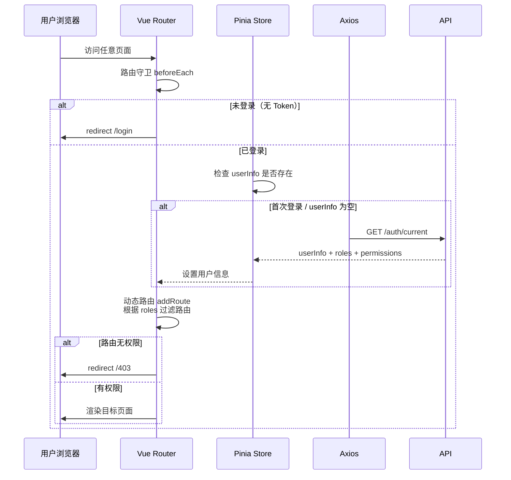

# JOSP-System 前端

企业级后台管理系统前端，基于 Vue 3 + Vite + TypeScript 构建，采用 Element Plus 组件库和 ECharts 数据可视化。

## 技术栈

| 分类 | 技术 | 版本 |
|------|------|------|
| 核心框架 | Vue 3 | 3.4+ (Composition API + `<script setup>`) |
| 构建工具 | Vite | 8.x |
| 语言 | TypeScript | 5+ (strict mode) |
| UI 组件库 | Element Plus | 2.4+ |
| 状态管理 | Pinia | 2.1+ |
| 路由 | Vue Router | 4+ (动态路由) |
| HTTP 客户端 | Axios | 1.6+ (请求/响应拦截器) |
| 可视化 | ECharts | 5.5+ |
| CSS 方案 | UnoCSS | 0.58+ (原子化 CSS) |
| 图标 | @iconify/vue + unocss-presets 图标集 | latest |

---

## 系统架构

```mermaid
graph TB
    subgraph 客户端 "浏览器"
        APP["Vue 3 App<br/>Composition API"]
        ROUTE["Vue Router 4<br/>动态路由 + 路由守卫"]
        STORE["Pinia Store<br/>用户信息 / 权限 / 主题"]
    end

    subgraph 请求层 "Axios"
        AX["Axios Instance<br/>请求拦截器 (Token)<br/>响应拦截器 (Error)"]
    end

    subgraph 后端 "Spring Boot :8081"
        API["REST API<br/>/api/v1/*"]
    end

    APP --> ROUTE
    APP --> STORE
    STORE --> AX
    AX --> API

    style APP fill:#e1f5ff,stroke:#1456f0,color:#000
    style API fill:#fff3e1,stroke:#f0a020,color:#000
```

---

## 项目结构

```
src/
├── api/                        # 接口层 — 所有 HTTP 请求
│   ├── auth.ts                # 登录 / 登出 / 当前用户
│   ├── config.ts              # 系统配置
│   ├── dashboard.ts           # 仪表盘数据
│   ├── notice.ts              # 通知公告
│   ├── dept.ts                # 部门管理
│   ├── dict.ts                # 字典查询
│   ├── menu.ts                # 菜单管理
│   ├── role.ts                # 角色管理
│   ├── user.ts                # 用户管理
│   ├── loginLog.ts            # 登录日志
│   ├── operLog.ts             # 操作日志
│   ├── file.ts                # 文件管理
│   └── demo.ts                # 示例接口
│
├── components/                # 公共组件
│   └── CURD/                  # 通用 CRUD 组件（大驼峰命名）
│       ├── PageSearch.vue     # 分页搜索栏
│       ├── PageTable.vue      # 分页数据表格
│       └── PageModal.vue      # 弹窗表单
│
├── composables/               # 组合式函数（hooks）
│   ├── useCountUp.ts         # 数字滚动动画
│   ├── useDict.ts            # 字典数据获取
│   └── useTabs.ts            # Tab 页签管理
│
├── layout/                   # 布局组件
│   ├── index.vue             # 主布局（侧边栏 + 顶部栏）
│   ├── Sidebar.vue           # 侧边导航栏
│   └── Topbar.vue            # 顶部导航栏
│
├── router/                   # 路由配置
│   ├── index.ts              # 路由实例 + 守卫
│   └── routes/               # 静态路由 + 动态路由
│
├── store/                    # Pinia 状态管理
│   └── modules/
│       ├── user.ts           # 用户信息 + Token
│       ├── permission.ts     # 权限路由树
│       └── tab.ts            # 多 Tab 页签
│
├── styles/                   # 全局样式
│   ├── variables.css         # CSS 变量（主题色 / 圆角 / 阴影）
│   └── index.css             # 全局 reset + 字体
│
├── utils/                    # 工具函数
│   ├── request.ts            # Axios 实例封装
│   ├── auth.ts              # Token 读写 / 用户信息解析
│   └── format.ts            # 日期 / 数字格式化
│
└── views/                    # 页面视图
    ├── dashboard/            # 仪表盘（ECharts 图表）
    ├── login/                # 登录页（左右分栏）
    ├── personal/             # 个人中心
    ├── notice/              # 通知公告
    ├── error-page/          # 404 / 403 错误页
    └── system/              # 系统管理
        ├── user/            # 用户管理
        ├── role/            # 角色管理
        ├── menu/            # 菜单管理
        ├── dept/            # 部门管理
        ├── dict/            # 字典管理
        ├── login-log/        # 登录日志
        ├── oper-log/         # 操作日志
        └── monitor/          # 系统监控
```

---

## 功能模块

| 页面 | 路由 | 说明 |
|------|------|------|
| 登录 | `/login` | 用户名密码登录、验证码、主题切换 |
| 管理看板 | `/dashboard` | ECharts 图表（用户统计/访问趋势/部门分布） |
| 个人中心 | `/personal` | 个人信息展示、密码修改 |
| 用户管理 | `/system/user` | 用户 CRUD、分配角色、状态管理 |
| 角色管理 | `/system/role` | 角色 CRUD、分配菜单权限 |
| 菜单管理 | `/system/menu` | 菜单树形 CRUD（M 目录 / C 菜单 / B 按钮） |
| 部门管理 | `/system/dept` | 部门树形 CRUD |
| 字典管理 | `/system/dict` | 字典类型 + 字典数据管理 |
| 登录日志 | `/system/login-log` | 登录日志分页、IP 归属地 |
| 操作日志 | `/system/oper-log` | 操作日志分页、详情查看、清空 |
| 通知公告 | `/notice` | 公告列表、发布、撤回、置顶 |
| 系统监控 | `/system/monitor` | 服务器 / 数据库 / Redis 状态卡片 |
| 系统配置 | `/system/config` | 系统参数配置管理 |

---

## 页面布局

```
┌──────────────────────────────────────────────────────────┐
│  [Logo / 系统名称]  │  顶部栏：面包屑 + 用户信息 + 退出  │
├────────────┬─────────────────────────────────────────────┤
│            │                                             │
│  侧边栏     │           主内容区域                        │
│  导航菜单   │                                             │
│            │  ┌─────────────────────────────────────┐    │
│  ○ Dashboard│  │  [页面标题]  [操作按钮]             │    │
│  ○ 系统管理  │  ├─────────────────────────────────────┤    │
│    - 用户   │  │  [搜索筛选栏]                        │    │
│    - 角色   │  ├─────────────────────────────────────┤    │
│    - 菜单   │  │                                     │    │
│    - 部门   │  │  [数据表格 / 图表 / 表单]             │    │
│  ○ 日志    │  │                                     │    │
│  ○ 通知    │  └─────────────────────────────────────┘    │
│  ○ 监控    │                                             │
└────────────┴─────────────────────────────────────────────┘
```

---

## 路由鉴权流程



---

## 主题与设计规范

本项目遵循 `DESIGN.md` 中定义的设计系统。

### 品牌色

| 用途 | 色值 | 说明 |
|------|------|------|
| 主色（品牌蓝） | `#1456f0` | 侧边栏 / 按钮 / 链接 |
| 成功 | `#10b981` | 状态正常 / 成功提示 |
| 警告 | `#f59e0b` | 警告状态 |
| 危险 | `#ef4444` | 错误 / 删除 / 停用 |
| 信息 | `#3b82f6` | 信息提示 |

### 字体

| 用途 | 字体 | 回退 |
|------|------|------|
| 中文正文 | `DM Sans` | `Outfit`, sans-serif |
| 英文/数字 | `Outfit` | sans-serif |
| 代码 | `JetBrains Mono` | `Fira Code`, monospace |

### 圆角

- 按钮/输入框：`9999px`（胶囊状）
- 卡片/容器：`12px`
- 弹窗/下拉：`16px`

### 阴影

- 卡片：`0 1px 3px rgba(0,0,0,0.1), 0 1px 2px rgba(0,0,0,0.06)`
- 悬浮：`0 4px 16px rgba(20,85,240,0.16)`（品牌蓝发光）

---

## 环境变量

| 变量 | 说明 | 默认值 |
|------|------|--------|
| `VITE_APP_TITLE` | 浏览器标签标题 | `JOSP-System` |
| `VITE_API_BASE_URL` | 后端 API 基础路径 | `/api/v1` |

---

## 快速开始

### 环境要求

- Node.js 18+
- pnpm 8+

### 安装与运行

```bash
# 安装依赖
pnpm install

# 开发模式（热更新）
pnpm dev
# 访问 http://localhost:5173

# 类型检查（不阻塞 dev）
pnpm type-check

# 生产构建
pnpm build

# 预览构建产物
pnpm preview

# ESLint 检查
pnpm lint
```

### 构建输出

| 产物 | 路径 |
|------|------|
| 构建结果 | `dist/` |
| 依赖分析 | `dist/stats.html`（运行 `pnpm preview` 查看） |

---

## 与后端对接

前端请求统一通过 `src/utils/request.ts` 发送，BaseURL 指向 `/api/v1`。

**请求拦截器**：自动在 `Authorization` header 注入 `Bearer {token}`。

**响应拦截器**：对 401 自动跳转登录页，403 跳转 403 页，500+ 显示错误消息。

---

## 相关文档

- [DESIGN.md](DESIGN.md) — 设计系统规范
- [../../JOSP-SystemTempleJava/README.md](../JOSP-SystemTempleJava/README.md) — 后端 README
