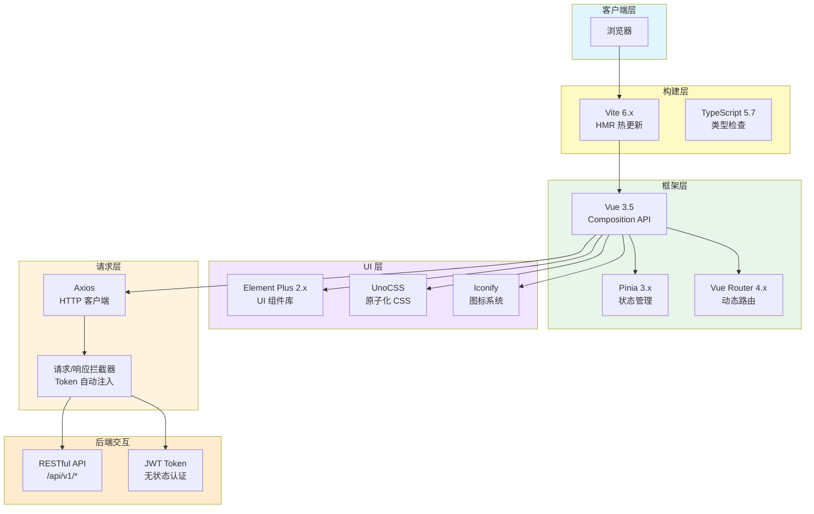
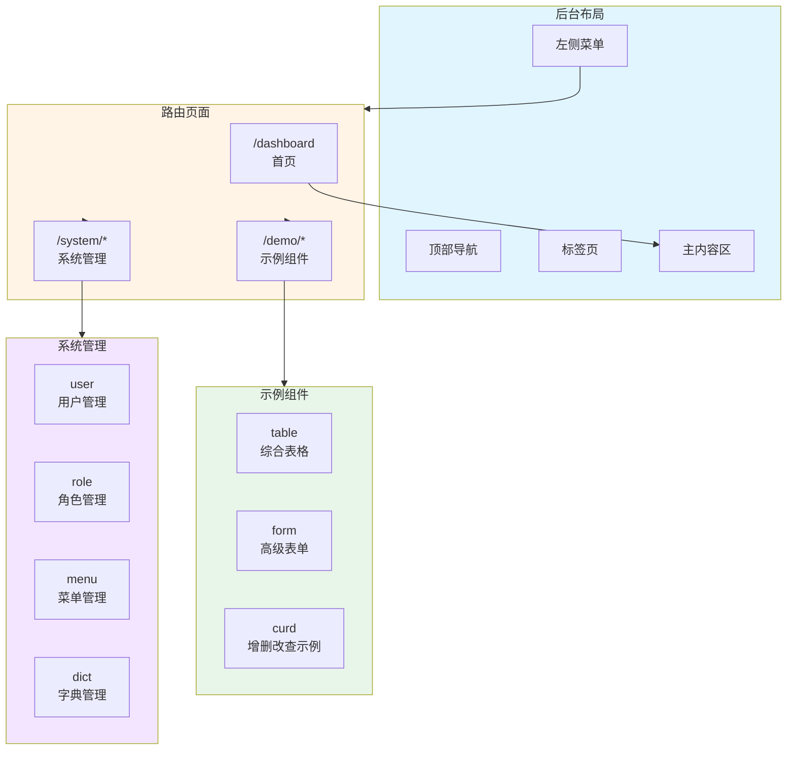
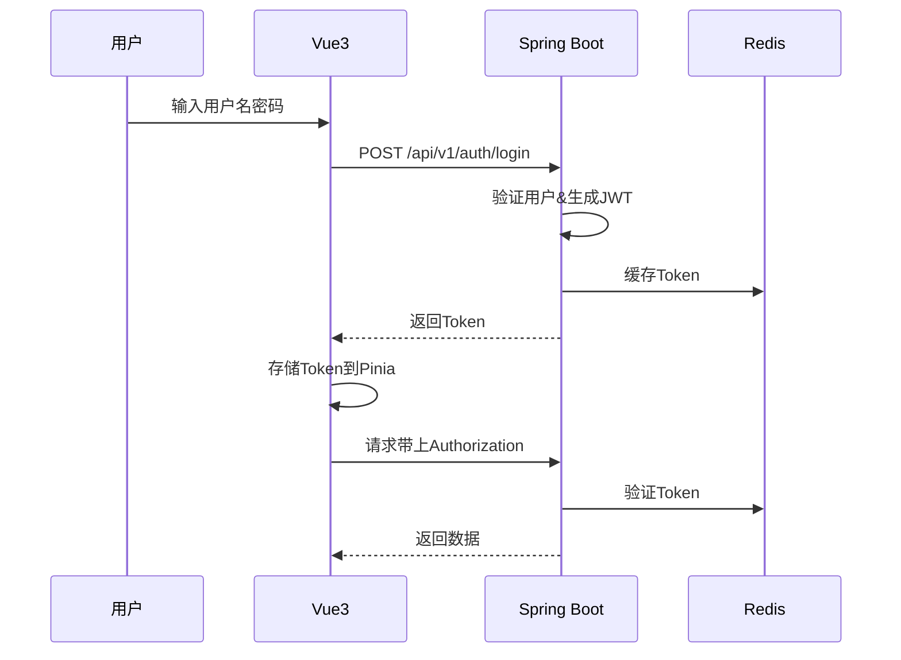

# JOSP-SystemTempleVue3


> **JOSP 前端系统模板** - 基于 Vue 3.5 + Vite + Element Plus + Pinia 的现代化后台管理系统。

---

## 配套后端模板

- **Java 版本**: [JOSP-SystemTempleJava](https://github.com/junwOpenSourceProjects/JOSP-SystemTempleJava)

---

## 系统架构



---

## 技术栈

| 技术 | 版本 | 说明 |
|------|------|------|
| Vue | 3.5.32 | 渐进式前端框架 |
| Vite | 6.0.7 | 下一代构建工具 |
| Element Plus | 2.13.6 | UI 组件库 |
| Pinia | 3.0.4 | 状态管理 |
| TypeScript | 5.7.3 | 类型支持 |
| Axios | 1.7.9 | HTTP 客户端 |
| UnoCSS | 0.65.x | 原子化 CSS 引擎 |
| Vue Router | 4.x | 路由管理 |
| @iconify/vue | 4.x | 图标组件 |

---

## 项目结构

```
JOSP-SystemTempleVue3/
├── src/
│   ├── api/                      # API 接口层
│   │   ├── auth/                 # 认证相关接口
│   │   ├── system/               # 系统管理接口
│   │   │   ├── user.ts
│   │   │   ├── role.ts
│   │   │   ├── menu.ts
│   │   │   └── dict.ts
│   │   └── demo/                 # 示例接口
│   │       └── index.ts
│   │
│   ├── views/                    # 页面视图
│   │   ├── dashboard/           # 首页
│   │   ├── login/               # 登录页
│   │   ├── system/              # 系统管理
│   │   │   ├── user/            # 用户管理
│   │   │   ├── role/            # 角色管理
│   │   │   ├── menu/            # 菜单管理
│   │   │   └── dict/            # 字典管理
│   │   ├── demo/                # 示例组件
│   │   │   ├── table/           # 综合表格
│   │   │   ├── form/            # 高级表单
│   │   │   ├── curd/            # CRUD 示例
│   │   │   └── ...
│   │   └── error-page/          # 错误页面
│   │
│   ├── layout/                   # 布局组件
│   │   ├── components/          # 布局子组件
│   │   │   ├── Sidebar/         # 侧边栏
│   │   │   ├── Navbar/          # 顶部导航
│   │   │   └── TagsView/        # 标签页
│   │   └── index.vue
│   │
│   ├── router/                   # 路由配置
│   │   └── index.ts             # 静态+动态路由
│   │
│   ├── store/                    # 状态管理
│   │   └── modules/
│   │       ├── user.ts          # 用户状态+Token
│   │       ├── permission.ts    # 权限+路由
│   │       └── dict.ts          # 字典缓存
│   │
│   ├── utils/                    # 工具函数
│   │   ├── request.ts          # Axios 封装（拦截器）
│   │   └── auth.ts             # Token 管理
│   │
│   ├── components/              # 公共组件
│   ├── directives/              # 自定义指令
│   ├── plugins/                 # 插件配置
│   ├── styles/                  # 全局样式
│   ├── typings/                 # TypeScript 类型声明
│   ├── lang/                    # 国际化
│   │
│   ├── App.vue                  # 根组件
│   └── main.ts                 # 入口文件
│
├── .env.development             # 开发环境变量
├── .env.production              # 生产环境变量
├── package.json
└── vite.config.ts
```

---

## 页面路由



---

## 功能特性

### 已完成功能

| 模块 | 功能 |
|------|------|
| **首页** | 数据统计展示、手动刷新功能 |
| **综合表格** | 分页列表、搜索过滤、弹窗编辑、新增/删除确认 |
| **用户管理** | 用户列表、状态切换 |
| **角色管理** | 角色列表、权限配置 |
| **菜单管理** | 树形菜单、动态路由 |
| **字典管理** | 字典类型、字典数据（含 Redis 缓存） |
| **认证** | JWT Token 登录、退出、Token 刷新 |

### 认证流程



---

## 快速开始

```bash
# 1. 安装依赖
pnpm install

# 2. 启动开发服务器
pnpm dev

# 3. 构建生产版本
pnpm build
```

---

## 环境变量

`.env.development`:
```env
# API 代理前缀
VITE_APP_BASE_API = '/dev-api'

# 后端接口地址
VITE_APP_API_URL = http://localhost:8081
```

---

## 许可证

本项目采用 **AGPL-3.0** 许可证 - 详情见 [LICENSE](LICENSE) 文件。
