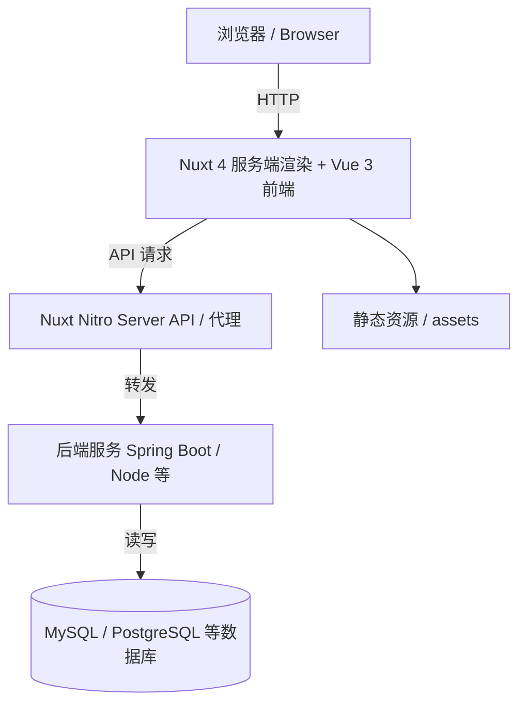

# JOSP-SystemTempleVue3

## 项目简介

JOSP-SystemTempleVue3 是一个基于 **Vue 3 + Nuxt 4 + TypeScript** 的后台管理系统模板。项目以「系统模板」为核心定位，提供一套开箱即用的中后台前端脚手架，包含：

- 基于 `@nuxt/ui` 的仪表盘布局与侧边栏导航
- 响应式的首页与仪表盘页面
- 统一的 HTTP 请求封装与 API 组织方式
-  ready-to-use 的模块结构，便于快速扩展用户管理、模板管理、系统设置等中后台常见模块

本项目旨在为 JOSP 系列系统提供统一、现代、可维护的前端工程化起点。

## 系统架构图



说明：

- 前端层使用 Nuxt 4 提供的服务端渲染（SSR）与客户端路由能力。
- `app/api/` 与 `app/utils/request.js` 负责统一接口请求。
- 生产环境中可通过 Nuxt Nitro 代理到独立后端服务，实现前后端分离部署。

## 技术栈

| 层级 | 技术 |
| --- | --- |
| 前端框架 | [Vue 3](https://vuejs.org/)（组合式 API + `<script setup>`） |
| 全栈框架 | [Nuxt 4](https://nuxt.com/) |
| UI 组件库 | [@nuxt/ui](https://ui.nuxt.com/) v4 |
| 类型系统 | TypeScript 5 |
| 构建工具 | Vite（Nuxt 内置） |
| 包管理器 | pnpm |
| 代码规范 | ESLint / Prettier（建议后续接入） |

## 项目结构

```text
JOSP-SystemTempleVue3/
├── app/                    # Nuxt 4 应用目录
│   ├── api/                # 前端 API 接口封装
│   │   └── index.js
│   └── utils/              # 工具函数
│       └── request.js      # 基于 axios 的请求封装
├── assets/                 # 静态资源（样式、图片等）
│   └── css/
│       └── main.css
├── layouts/                # 页面布局
│   └── default.vue         # 默认仪表盘布局（含侧边栏）
├── pages/                  # 页面路由
│   ├── index.vue           # 首页
│   └── dashboard.vue       # 仪表盘
├── app.vue                 # 应用根组件
├── nuxt.config.ts          # Nuxt 配置文件
├── package.json            # 项目依赖与脚本
├── pnpm-lock.yaml          # pnpm 锁定文件
├── LICENSE                 # AGPL-3.0 开源协议
└── README.md               # 项目说明
```

## 启动方式

> 本项目使用 [pnpm](https://pnpm.io/) 作为包管理器。若尚未安装，请先执行 `npm install -g pnpm`。

### 1. 安装依赖

```bash
pnpm install
```

### 2. 启动开发服务器

```bash
pnpm dev
```

默认启动地址为 `http://localhost:3000`。

### 3. 常用脚本

```bash
pnpm build      # 生产构建
pnpm generate   # 静态站点生成
pnpm preview    # 预览生产构建
```

### 环境变量（可选）

如需自定义后端接口地址，可在项目根目录创建 `.env` 文件：

```env
NUXT_PUBLIC_BASE_URL=/api
```

## 开源协议

本项目采用 [GNU Affero General Public License v3.0](LICENSE)（AGPL-3.0）开源协议。

> 根据 AGPL-3.0 协议，如果您在本项目基础上进行修改并通过网络提供服务，必须公开您的源代码。详细信息请参阅 [LICENSE](LICENSE) 文件或访问 [GNU AGPL-3.0 官方文本](https://www.gnu.org/licenses/agpl-3.0.txt)。
