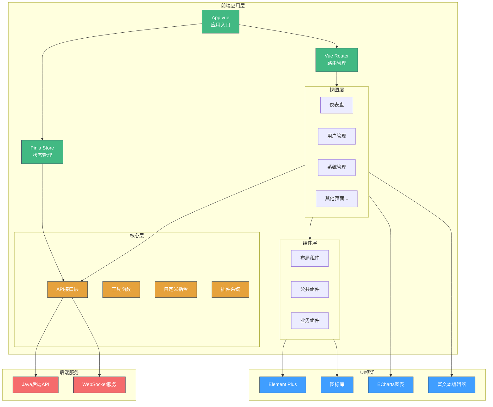

# JOSP-TempleVue3

vue3的后台模板,后续不修改

## 系统架构

```mermaid
graph TB
    subgraph Frontend["前端应用层"]
        App[App.vue<br/>应用入口]
        Router[Vue Router<br/>路由管理]
        Store[Pinia Store<br/>状态管理]
        
        subgraph Views["视图层"]
            Dashboard[仪表盘]
            UserManage[用户管理]
            SystemManage[系统管理]
            OtherViews[其他页面...]
        end
        
        subgraph Components["组件层"]
            Layout[布局组件]
            Common[公共组件]
            Business[业务组件]
        end
        
        subgraph Core["核心层"]
            API[API接口层]
            Utils[工具函数]
            Directive[自定义指令]
            Plugins[插件系统]
        end
    end
    
    subgraph UI["UI框架"]
        ElementPlus[Element Plus]
        Icons[图标库]
        Echarts[ECharts图表]
        WangEditor[富文本编辑器]
    end
    
    subgraph Backend["后端服务"]
        JavaAPI[Java后端API]
        WebSocket[WebSocket服务]
    end
    
    App --> Router
    App --> Store
    Router --> Views
    Views --> Components
    Views --> API
    Store --> API
    Components --> ElementPlus
    Components --> Icons
    Views --> Echarts
    Views --> WangEditor
    API --> JavaAPI
    API --> WebSocket
    
    classDef frontendStyle fill:#42b983,stroke:#35495e,color:#fff
    classDef uiStyle fill:#409eff,stroke:#35495e,color:#fff
    classDef backendStyle fill:#f56c6c,stroke:#35495e,color:#fff
    classDef coreStyle fill:#e6a23c,stroke:#35495e,color:#fff
    
    class App,Router,Store frontendStyle
    class ElementPlus,Icons,Echarts,WangEditor uiStyle
    class JavaAPI,WebSocket backendStyle
    class API,Utils,Directive,Plugins coreStyle
```
