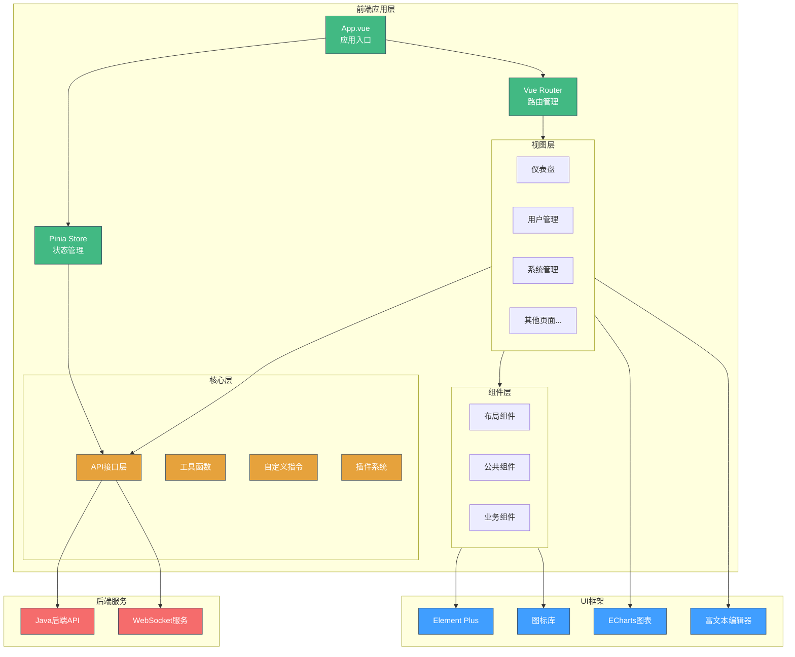

# JOSP-SystemTempleVue3 - 大学查询系统与后台管理前端


> 基于vue3-element-admin模板的大学查询与后台管理系统前端

## 📖 项目简介

JOSP-SystemTempleVue3 是基于vue3-element-admin模板开发的综合管理系统前端,集成大学信息查询、用户权限管理、系统配置等功能模块。

**后端项目**: [JOSP-SystemTempleJava](../JOSP-SystemTempleJava)

**技术来源**: vue3-element-admin (有来开源组织)

## ✨ 核心特性

- 🎓 **大学信息查询** - QS/USNews排名查询、按大洲国家筛选
- 👥 **用户权限管理** - 用户管理、角色管理、菜单管理、部门管理
- 📊 **数据可视化** - ECharts图表展示、仪表盘
- 📝 **富文本编辑** - wangEditor编辑器集成
- 🔐 **RBAC权限控制** - 基于角色的访问控制
- 🌐 **国际化支持** - vue-i18n多语言
- 📱 **响应式设计** - 多端适配

## 🛠️ 技术栈

| 技术 | 版本 | 说明 |
|------|------|------|
| Vue | 3.5.12 | 渐进式JavaScript框架 |
| Vite | 5.4.9 | 下一代前端构建工具 |
| Element Plus | 2.8.6 | Vue3 UI组件库 |
| Pinia | 2.2.4 | Vue3状态管理 |
| Vue Router | 4.4.5 | Vue3官方路由 |
| TypeScript | 5.6.3 | JavaScript超集 |
| Axios | 1.7.7 | HTTP客户端 |
| ECharts | 5.5.1 | 数据可视化库 |
| wangEditor | 5.1.23 | 富文本编辑器 |
| vue-i18n | 10.0.6 | 国际化解决方案 |
| ExcelJS | 4.4.0 | Excel文件处理 |

## 💡 核心功能模块

### 1. 大学信息查询系统

**功能特性:**
- 按大学名称搜索
- 按大洲筛选(亚洲/欧洲/北美洲/南美洲/非洲/大洋洲/南极洲)
- 按国家筛选
- QS排名查询
- USNews排名查询
- CS专业排名查询

```vue
<!-- src/views/university/Page1.vue -->
<el-form :model="searchForm">
  <el-form-item label="大学名称">
    <el-input v-model="searchForm.universityName" />
  </el-form-item>
  <el-form-item label="所在大洲">
    <el-select v-model="searchForm.universityTagsState">
      <el-option label="亚洲" value="亚洲" />
      <el-option label="欧洲" value="欧洲" />
      <el-option label="北美洲" value="北美洲" />
    </el-select>
  </el-form-item>
  <el-form-item label="QS排名高于">
    <el-input-number v-model="searchForm.currentRank" :min="1" />
  </el-form-item>
</el-form>
```

### 2. 用户管理系统

**功能特性:**
- 用户列表查询
- 部门树形结构
- 用户状态管理
- 用户导入导出
- 批量删除
- 权限分配

```vue
<!-- src/views/system/user/index.vue -->
<el-form :model="queryParams">
  <el-form-item label="关键字">
    <el-input v-model="queryParams.keywords" placeholder="用户名/昵称/手机号" />
  </el-form-item>
  <el-form-item label="状态">
    <el-select v-model="queryParams.status">
      <el-option label="启用" value="1" />
      <el-option label="禁用" value="0" />
    </el-select>
  </el-form-item>
</el-form>
```

### 3. 系统管理模块

- **部门管理** - 组织架构树形展示
- **角色管理** - 角色定义与权限分配
- **菜单管理** - 动态菜单配置
- **字典管理** - 数据字典维护

## 系统架构


